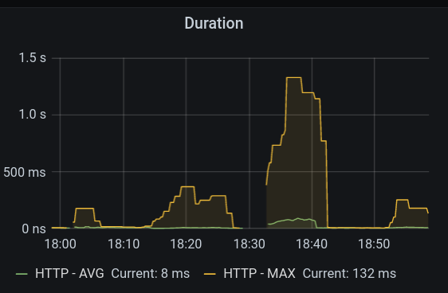
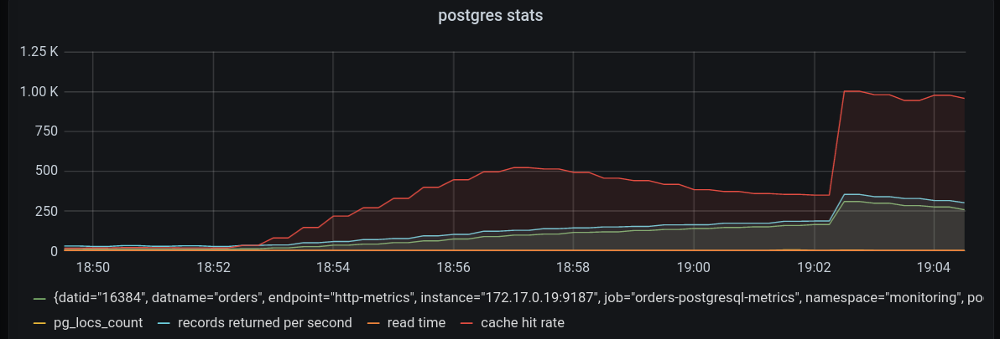

# Курсовая работа
## Инструкция по установке:
Запустить миникуб
Убедиться что аддон с ингресом установлен
В директории с чартами course_project_k8s выполнить команды:
Подготовка:
```
kubectl create namespace monitoring
kubectl config set-context --current --namespace=monitoring
```

Установка kafka 
```
kubectl create namespace kafka && \
kubectl apply -k github.com/Yolean/kubernetes-kafka/variants/dev-small/?ref=v6.0.3
```

Запуск сервисов:
зайти в директорию course_project_k8s
```
helm install accounting accounting-chart && \
helm install catalog catalog-chart  && \
helm install history history-chart  && \
helm install orders orders-chart && \
helm install inventory inventory-chart  && \
helm install auth auth-chart 
```
Настройка ингресса
``` 
kubectl apply -f auth-ingress.yaml 
kubectl apply -f auth-ingress-user.yaml
kubectl apply -f app-ingress.yaml
```


Установка locust
```
Нужен python3 и pip3
После чего pip install locust
Если возникают проблемы то еще нужно pip install python-dev
```

### Проверка производительности - каталог продуктов
Запуск locust в директории locust

```
locust
Все параметры находятся в locust.conf
```
Пример запуска сервиса продуктов с включенным кэшем
```
[2020-08-28 18:24:20,251] dk-ryzen/WARNING/locust.runners: CPU usage was too high at some point during the test! See https://docs.locust.io/en/stable/running-locust-distributed.html for how to distribute the load over multiple CPU cores or machines
[2020-08-28 18:24:20,251] dk-ryzen/INFO/locust.main: Running teardowns...
[2020-08-28 18:24:20,251] dk-ryzen/INFO/locust.main: Shutting down (exit code 0), bye.
[2020-08-28 18:24:20,251] dk-ryzen/INFO/locust.main: Cleaning up runner...
 Name                                                          # reqs      # fails  |     Avg     Min     Max  Median  |   req/s failures/s
--------------------------------------------------------------------------------------------------------------------------------------------
 GET /catalog/brand/                                            29788     0(0.00%)  |     119       2    1445     130  |   49.50    0.00
 GET /catalog/category/                                         29781     0(0.00%)  |     117       2    1282     130  |   49.49    0.00
 POST /catalog/search/                                         741655     0(0.00%)  |     113       1    1434     120  | 1232.46    0.00
 POST /login                                                      300     0(0.00%)  |      48       2     541      30  |    0.50    0.00
 POST /register                                                   300     0(0.00%)  |     157       4    1351      62  |    0.50    0.00
--------------------------------------------------------------------------------------------------------------------------------------------
 Aggregated                                                    801824     0(0.00%)  |     113       1    1445     120  | 1332.45    0.00

Response time percentiles (approximated)
 Type     Name                                                              50%    66%    75%    80%    90%    95%    98%    99%  99.9% 99.99%   100% # reqs
--------|------------------------------------------------------------|---------|------|------|------|------|------|------|------|------|------|------|------|
 GET      /catalog/brand/                                                   130    150    160    160    180    210    250    290   1200   1300   1400  29788
 GET      /catalog/category/                                                130    140    150    160    180    210    250    290   1100   1300   1300  29781
 POST     /catalog/search/                                                  120    140    150    160    180    200    240    280   1200   1300   1400 741655
 POST     /login                                                             30     54     73     82    120    150    180    240    540    540    540    300
 POST     /register                                                          63    140    240    280    480    670    780   1100   1400   1400   1400    300
--------|------------------------------------------------------------|---------|------|------|------|------|------|------|------|------|------|------|------|
 None     Aggregated                                                        120    140    150    160    180    200    240    280   1200   1300   1400 80
```
Сервис получения информации о продукте с кэшем RPS


Приложение каталога продуктов с кэшем и без кэша RPS


Приложение каталога продуктов с кэшем и без кэша latency



Нагрузка на базу с кэшем и без кэша


### Проверка производительности - сложный сценарий (регистрация и оформление заказа)
Применим более сложный сценарий с регистрацией пользователя и созданием заказа.
В этом случае сервис заказа ждет пока сервис склада найдет освободившийся тренажер на нужное время,
это является узким местом отсюда видим очень слабый rps 10 и ниже. Повод для оптимизации.

Сервис заказов


БД заказов 


Сервис склада


БД склада 


 


 
