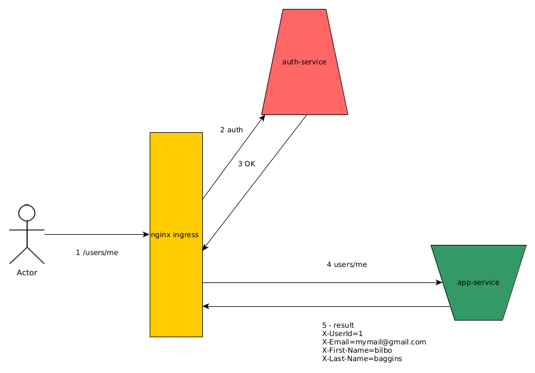

## Домашнее задание по API Gateway:
### Задача
Инструментировать сервис метриками и алертами.
Инструментировать сервис из прошлого занятия метриками в формате Prometheus.
Сделать дашборд в Графане, в котором были бы метрики с разбивкой по API методам:
Настроить алертинг в графане на Error Rate и Latency.
Инструментировать базу данных с помощью экспортера для prometheus для этой БД.
Добавить в общий дашборд графики с метриками работы БД.
Используя существующие системные метрики из кубернетеса, добавить на дашборд графики с метриками:
1. Потребление подами приложения памяти
2. Потребление подами приложения CPU

## Схема работы 
Применен подход forward auth на основе ngnix ingress  



## Инструкция по установке:
Запустить миникуб
Убедиться что аддон с ингресом установлен
В директории с чартами (hw_api_gateway) выполнить команды:
Подготовка:
```
kubectl create namespace auth
kubectl config set-context --current --namespace=auth
```

Запуск сервиса аутентификации и основного приложения:
```
helm install auth ./auth/auth-chart/
helm install app ./app/app-chart/
```

Настройка ингресса
``` 
kubectl apply -f auth-ingress.yaml 
kubectl apply -f auth-ingress-user.yaml
kubectl apply -f app-ingress.yaml
```

## Проверка через newman
newman run homework_api_gateway_nginx_forward_auth.postman_collection.json


 
