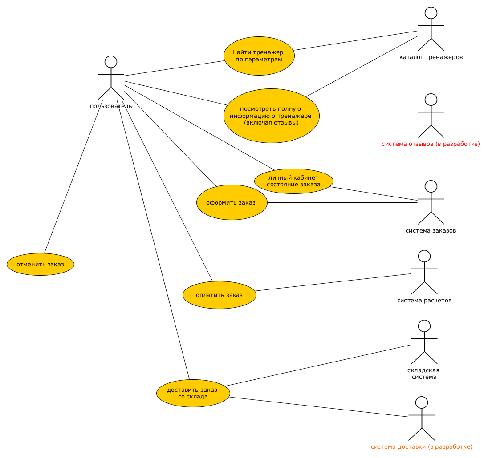
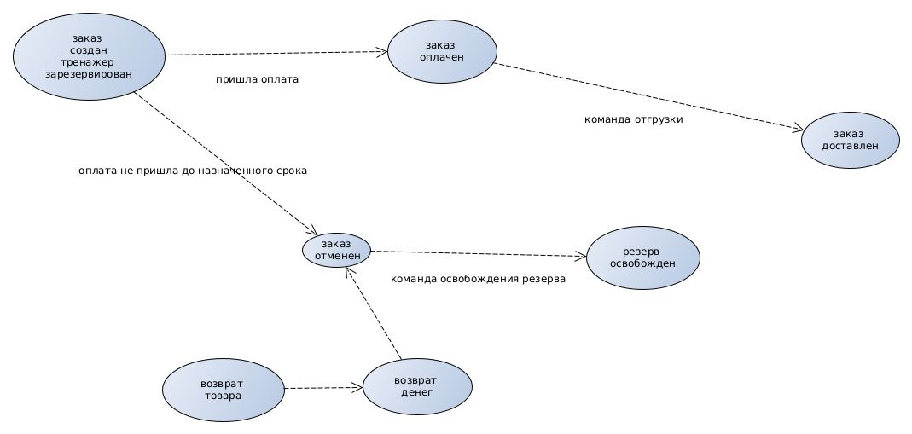
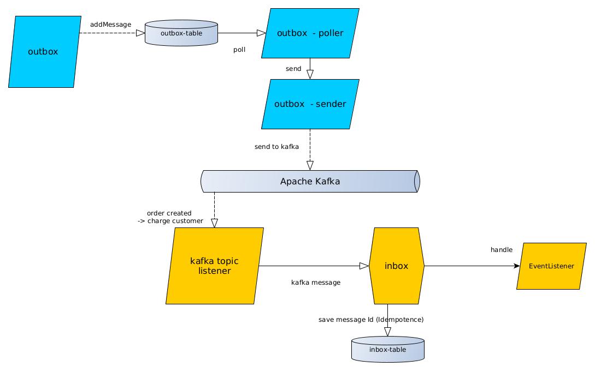
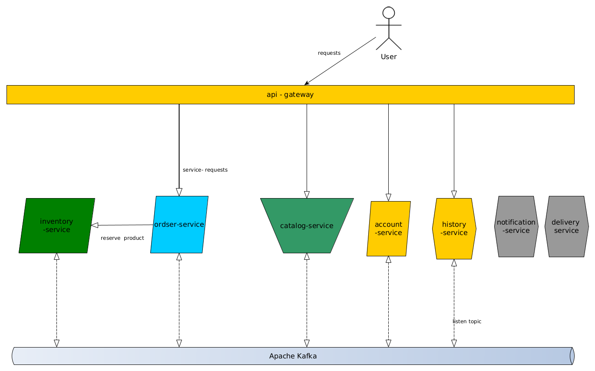
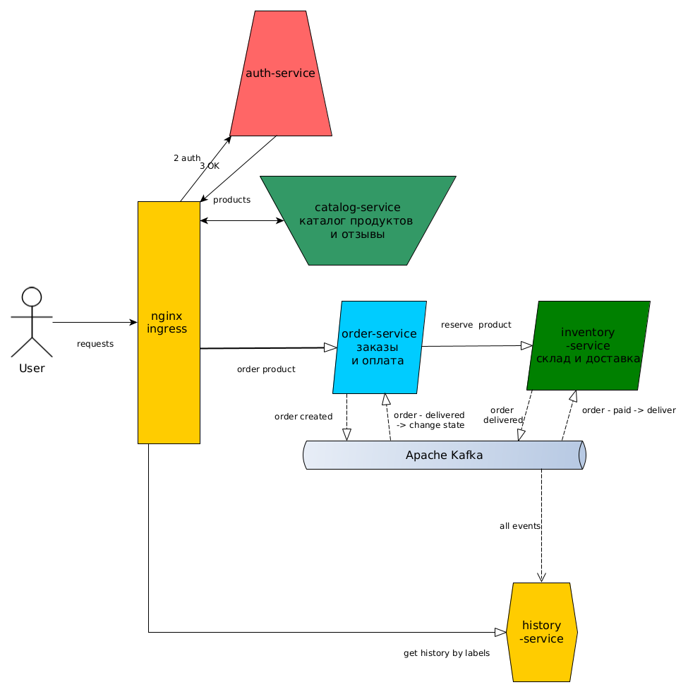
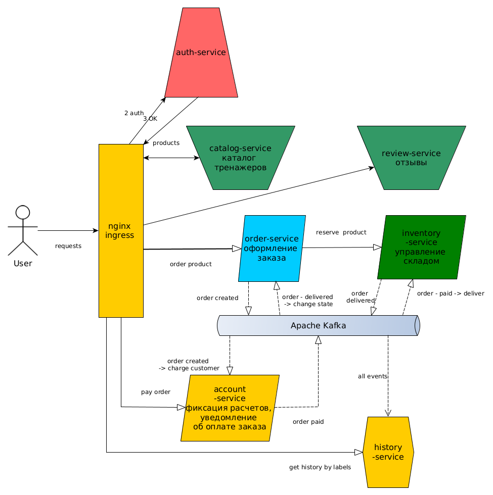

# Декомпозиция сервисов
### Рассматривал следующие варианты использования:

Позитивный сценарий - 
* пользователь ищет нужный тренажер
* оформляет заказа на период времени
* оплачивает его
* получает тренажер

Негативный сценарий  
* пользователь ищет нужный тренажер
* оформляет заказа на период времени
* не оплачивает его до нужного момента
* мы отмечаем что оплаты нет
* отменяем резерв
* отменяем заказ 

### Основной жизненный цикла заказа:

### Подход к взаимодействию сервисов:
Система пытается работать на событиях, event-driven. События система кидает в свой топик, все интересующиеся сервисы подписываются на него.
Единственное место взаимодействия двух сервисов через REST - резервирование тренажера при оформлении заказа.
Блокирующий вызов.
Была мысль что так архитектура будет проще - сложность будет линейно расти с увеличением числа сервисов.

### Шаблон outbox как основа обмена между сервисами
В случае бизнес операции кладем событие в интерфейс outbox, тот в этой же транзакции сохраняет запись в базу.
Далее (должен быть отдельный) специальный сервис просматривает эту таблицу каждые n секунд, 
и увидев неотправленные сообщения отправляет их через кафку.

Сервисы которые заинтересованы в получении событий из топика куда отправлено событие
подписываются на топик и получив сообщение из кафки передают его в inbox. inbox проверяет не загружено ли было сообщение ранее, и если нет то находит его обработчик и запускает его выполнение.
 

### Упрощенная схема работы:

### Варианты реализации:
Думал о двух вариантов - более укрупненном:
 

и более детальном, на нем и остановился: 

